# SmartCart

 

## Overview

SmartCart is a smart shopping cart aimed to replace existing shopping carts and checkout systems in grocery stores. The user will be able to upload a predetermined grocery list that will be displayed on a monitor in the form of a floorplan of the store with the most optimal path to cover each item. Their phone will keep track of the items in their current shopping cart as well as the total cost. Once the user leaves the store lot, their account will be charged through their phone. They will then be able to look at qualitative statistics related to their past orders.

## Index

- [Pre-requisites](#pre-requisites)
- [Target Market and Requirements](#target-market-and-requirements)
- [Hardware Architecture](#hardware-architecture)
- [Software Functionality](#software-functionality)
- [Project Members](#project-members)

## Pre-requisites

* Quartus Prime II Lite 18.1
* Intel FPGA Monitor Program
* Cygwin
* DS5

## Target Market and Requirements
### Target Market
Our target market is big-name supermarkets (Safeway, Loblaws, Walmart), aiming to improve convenience for busy, tech-savvy people. For this project, we need to consider two stakeholders: the retailer who would buy and offer these carts in their stores and users that would use the carts to shop.

### List of Constraints and Needs
##### By Users:
* Responsive, quick, easy-to-use user interface
* Convenient, fast, bug-free shopping experience 

##### By Retailers:
* Low maintenance costs and error rate
* Removal of human error in checkout 
* Access to real-time user data
* Enhanced security/ theft protection 

### Project Requirements
* Responsive, quick, easy-to-use user interface
* A quick scan/place and go use case
* A map of the store for quick navigation and an optimal route algorithm
* Simplified checkout experience through paying on the android app
* Give retailers access to real-time user data
* Improved security through scanner and sensors

## Hardware Architecture

- ARM Processor:
The ARM Processor will be used to interface with the RFS Board. It will be the main bridge between our software and hardware.

- DE1-SoC FPGA:
The FPGA will be responsible for interfacing between the HX711 board and the VGA Monitor. Its main role will be for hardware acceleration. Namely, accelerating noise processing from the HX711, pathfinding of optimal routes in the store, and displaying graphics to the monitor.  

- RFS Board
The RFS Board will be used as a communication port between software and hardware. We will be using the Wi-Fi chip for communication between our Web-Server. The Bluetooth chip will be used for communicating with the Android device (phone).

- HX711 Board in conjunction with a 20kg Load Cell:
The HX711 Board is a load cell amplifier. In conjunction with a 20kg Load Cell, we will be making a weight scale to accurately measure the cart’s items’ weights.

- VGA Monitor:
The VGA Monitor will be responsible for displaying all of the shopping list items and the best route to get to them. 

### Overall Hardware Design

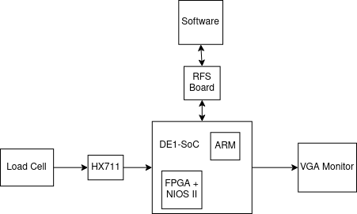

### HX711

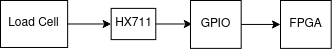

### RFS Board

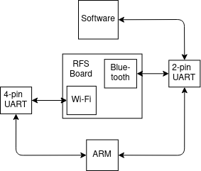

## Software Functionality
### Use Case Diagram
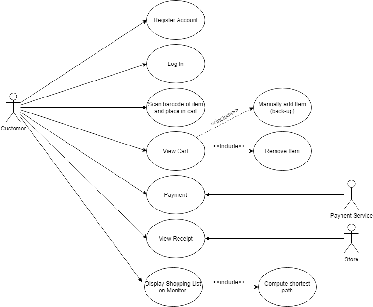

### Software features
* Register/login to your account using android to DE1-SoC to cloud server 
* Scan item with phone sending cart info to the cloud
* View your shopping cart on your phone
* Payment and view receipt on the phone by sending a request to DE1-SoC to the cloud server
* Search items and navigate on Android
* Show map and shopping list on a VGA monitor

### GUI Prototypes
##### Phone - Shopping
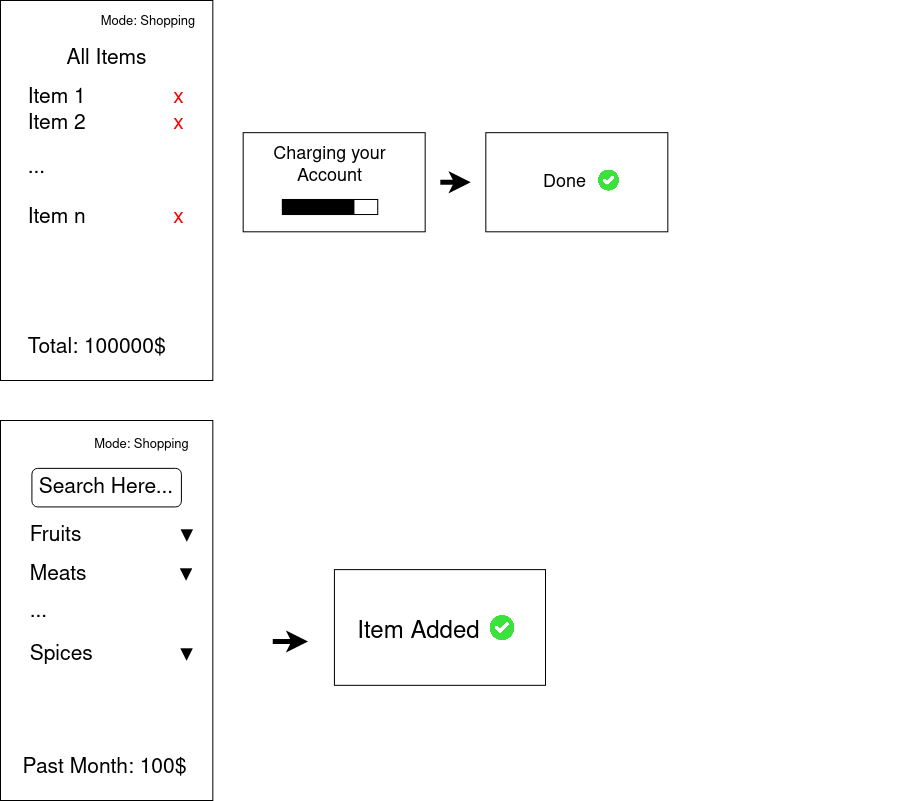

##### Phone - Not Shopping
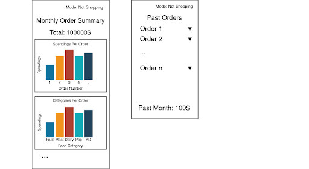

##### VGA Monitor
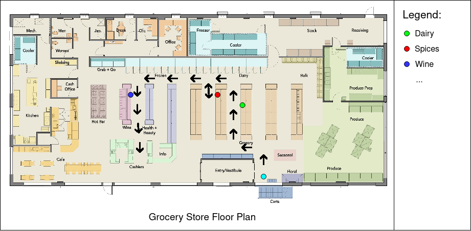

### Major Algorithmic Processing
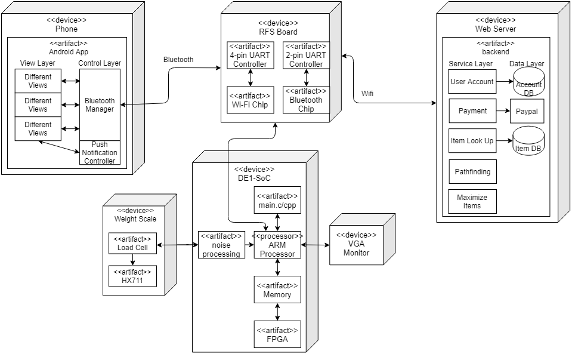

This diagram showcases the interactions between the different hardware and software components in our design. We interact between software and hardware through either memory-mapped interfaces (FPGA ⬌ ARM) or Bluetooth and Wi-Fi. 
In addition to the interaction between components, we have three major algorithms we need to process:
1. Pathfinding for the shortest route to pick up all items in the grocery store.
2. Noise processing for the HX711 (weighting system).
3. Optimizing for the max amount of items given the amount of money for a grocery list.

#### Pathfinding (A*)
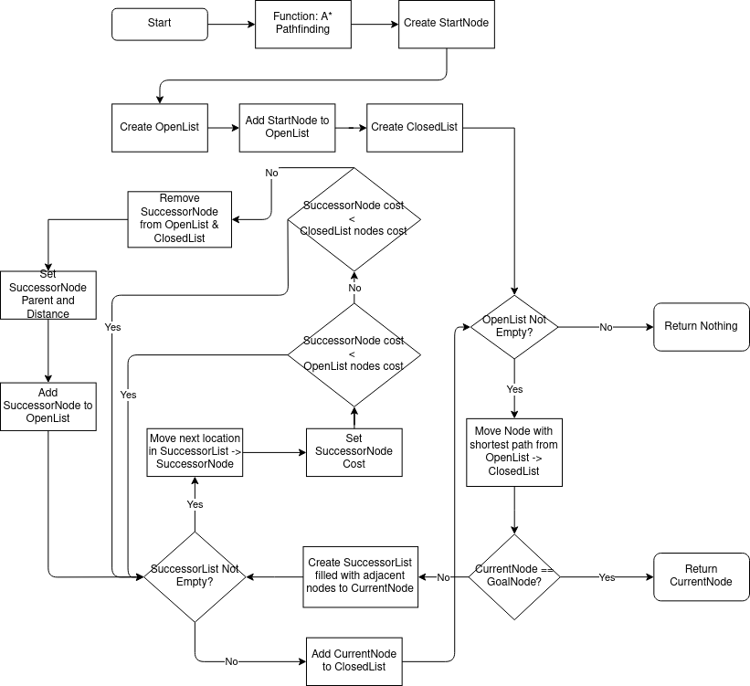

#### Noise Processing (weighing system)
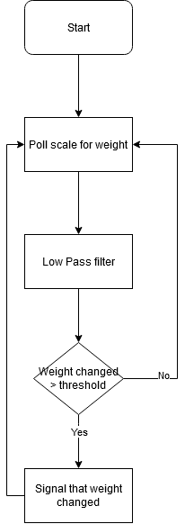

#### Maximizing Items (Knapsack Problem)
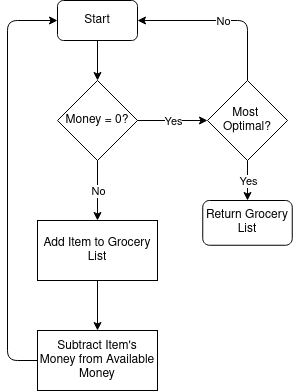

### Major Data Structures
The major data structures we will use are:

* 2D Array for the grid that will represent the grocery store map.
On-chip: the FPGA needs to help compute the optimal path and display it to the VGA monitor. 
Off-chip: the grocery store owner manages where each item is in the store. Ideally, they will map out the store on a grid in a web interface.

* Lists for the pathfinding algorithm (A*) as seen above.
On-chip: the FPGA will be accelerating the A* search which requires lists to implement.

* Lists for keeping track of both the grocery list and the current items in their cart.
Off-chip: the phone and web-server will be the only ones needing to keep track of these items.

* Relational database (e.g. MySQL) for managing registered users and their data
Off-chip: this will only be on the software side of the design. Only the phone application will require access to user data.

* Relational database (e.g. MySQL) for managing current stock of items and where they are
Off-chip: the database will live in the software space, but we will send queries through the RFS Board to get information about specific items in real-time.

* A Queue to manage Wi-Fi and Bluetooth requests.
On-chip: the RFS Board is how we interface to the internet and phone so we will need the stack of our requests to be managed on the ARM processor.

## Project Members

1. Amr Almoallim
1. Cody Li
1. Jared Paul
1. Jonathan Lew
1. Tawsif Hasan

